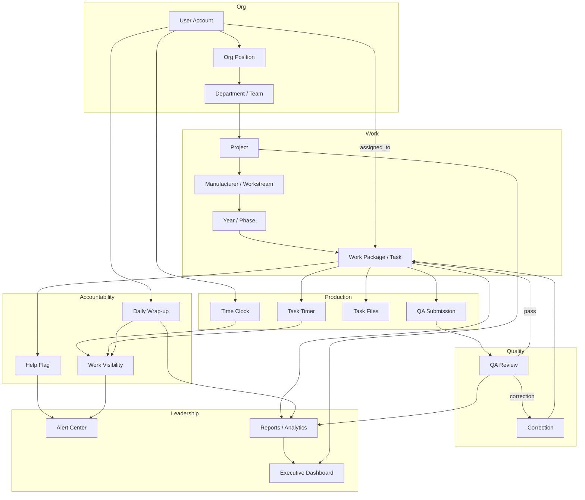

# Flow Operations Manual (Master Document)

**Version:** Flow 2 (v0.8.3-beta) — last updated July 7, 2026  
**Application:** Flow — Protech Production Management Platform  
**URL:** https://flowproduction.space

> This manual is updated as part of every deploy (see the Production QA
> Checklist). If a screen doesn't match this document, the document is the bug —
> report it in the Innovation Hub.

---

## What's New — Flow 2 (July 2026)

- **Batch submissions.** Analysts on long-running packages can send file
  batches to QA while continuing to work — "Submit batch for review" next to
  the final "Complete task & submit," which now shows a confirmation dialog
  warning when uploads are far below the estimated document count.
- **QA Center remodeled into two wings.** *Review* (human QA: review queue,
  in-progress batches, knowledge library, reports) and *Audit Engine* (the SI
  Library Audit Tool, fully integrated: audit runs, Library Validation,
  Library Intelligence, rule engine, analytics, settings).
- **The Audit Engine executes from the live site.** Runs queue in Supabase and
  an audit worker (`npm run audit-worker` on a machine with the Python engine)
  processes them; the Audit Engine door shows Worker online/offline.
- **Library Validation** (ported from the Audit App): validate any external
  report against the audited library. **Library Intelligence** consolidates
  Library Score, Executive Rollup, What Changed, and Smart Insights.
- **Files rebuilt.** Task uploads are a searchable, task-grouped browser with
  "need re-upload" badges (uploads made before July 6 never stored content and
  must be re-uploaded).
- **Time clock.** Workday-style weekly calendar tab; clocking out is no longer
  blocked by a *paused* timer, and the timer dialog gained "Pause & clock out."
- **Alerts.** Workload alerts show when they were raised and sort
  critical-first; open critical alerts trigger a once-per-session popup for
  leaders.
- **Accuracy fixes.** Hours and docs-per-hour now derive from real time logs
  and uploads (1 uploaded file = 1 completed document); submit→QA statuses
  persist reliably; task time totals sum every session (starting a new timer
  no longer "resets" the total); theme is the Nebula indigo-blue dark look.
- **Employee preview (July 8).** Leads and managers have an "Employee view"
  button in the header that flips them into the employee shell — their own
  identity, the exact UI the team sees (workspace, coach, badges,
  leaderboard). An amber banner marks the mode with one-click exit. Note:
  it is your real account — clocking in or submitting in preview is real.
- **Leaderboard (July 8).** The Performance page (sidebar: Workforce →
  Performance) leaderboard shows real badge counts with tier-colored badge
  icons, avatar frames, and flair titles; Flow Score still rules the ranking,
  with badge count breaking ties. Employees see the same board read-only at
  Workspace → Leaderboard. A Leads & reviewers section shows badges earned by
  team leads and managers.
- **Badge catalog expanded (July 8).** 26 badges across tiered families —
  bronze, silver, gold, and platinum: uploads (First Steps → Library Legend at
  2,500), single-day volume (Big Day, Century Day), batches (First Batch →
  Batch Overlord), QA passes (First Pass → Flawless), QA reviews performed
  (Gatekeeper → The Wall — how leads earn), clock discipline (Early Bird, Dawn
  Patrol, Timekeeper, Swiss Watch), report streaks (Paper Trail, Iron Streak),
  task time (Marathon, Ultra), and ideas. Cosmetic unlock thresholds
  rebalanced for the larger catalog (frames 3/8/14/20, accents 4/8/12/16).
- **Cosmetic unlocks (July 8).** Badges unlock account cosmetics: avatar
  frames (Bronze ring at 2 badges up to Nebula glow at 11), a wearable title
  from any earned badge, and workspace accent colors (Teal at 3, Amber at 5,
  Rose at 7, Emerald at 9). Customize from the Badges panel; unlocks are
  validated server-side against real badge state.
- **Badges (July 8).** Employees earn achievement badges automatically from
  their real work — Century Club (100 uploads), QA Darling (5 passes), Early
  Bird, Paper Trail (report streak), Timekeeper (30 clean days), and more.
  The workspace shows earned badges plus the next one within reach.
- **Auto-captured incidents (July 8).** The Evaluation panel now itemizes
  every event the system can see — clock punches a manager corrected (with
  the reason), clocked days without a daily report, QA returns — as
  auto-captured entries merged with the manual log and tagged AUTO. Manual
  logging remains for what systems can't see (conduct, attendance).
- **Workspace coach (July 8).** The employee workspace shows nudges when
  something needs attention: clocked in with no timer running, a pile of files
  ready to batch to QA, a long shift with no daily report, or a QA return
  waiting. Each employee picks their coach's **attitude** — Professional,
  Encouraging, Drill sergeant, or Smart-ass.
- **Ask Flow (July 8).** A help bubble on every page answers "how do I..."
  questions straight from this manual, with links to the exact section.
- **Employee evaluation (July 8).** Leads and managers see an Evaluation
  panel on employee profiles: automatic signals (clock punches corrected by a
  manager, days clocked without a daily report, QA corrections) plus a manual
  incident log with category, severity, and notes. Employees do not see their
  own panel.

---

## Table of Contents

1. [System Overview](#section-1--system-overview)
2. [Role-Based Access](#section-2--role-based-access)
3. [Dashboard Guide](#section-3--dashboard-guide)
4. [Org Chart](#section-4--org-chart)
5. [People Module](#section-5--people-module)
6. [Projects Module](#section-6--projects-module)
7. [Task Management](#section-7--task-management)
8. [Operations Module](#section-8--operations-module)
9. [Production Tracking](#section-9--production-tracking)
10. [Project Health](#section-10--project-health)
11. [QA System](#section-11--qa-system)
12. [Files & Documents](#section-12--files--documents)
13. [Reporting & Analytics](#section-13--reporting--analytics)
14. [Alerts & Notifications](#section-14--alerts--notifications)
15. [Time Clock & Daily Reports](#section-15--time-clock--daily-reports)
16. [System Settings](#section-16--system-settings)
17. [Troubleshooting](#section-17--troubleshooting)
18. [Data Flow](#section-18--data-flow)
19. [System Health Audit](#section-19--system-health-audit)
20. [Feature Inventory](#section-20--feature-inventory)

---

# SECTION 1 — SYSTEM OVERVIEW

## Purpose of Flow

Flow is Protech's internal production management platform. It replaces ad-hoc board tools with a unified system for:

- **Planning and delivering** document-production programs (projects)
- **Assigning and tracking** individual work packages (tasks)
- **Managing workforce** capacity, time, and accountability
- **Quality assurance** review and correction workflows
- **Executive visibility** into delivery risk, department health, and outcomes

Flow serves hourly and salaried production employees, team leads, managers, senior managers, administrators, and read-only viewers.

## Major Modules

| Module | Route | Primary Users |
|--------|-------|---------------|
| Executive Dashboard | `/executive` | Leadership, viewers |
| Alert Center | `/alert-center` | Managers, leads |
| Operations | `/operations` | Managers, leads, viewers |
| Projects | `/projects` | Managers, leads, senior managers |
| QA Review | `/qa-center` | QA reviewers, managers, leads |
| People | `/people` | Managers, leads, viewers |
| Org Chart | `/org-chart` | All management roles |
| Planning & Forecasting | `/planning` | Managers, leads |
| Project Health | `/project-health` | Managers, senior managers |
| Production | `/production` | Managers, leads |
| Reports / Analytics | `/reports`, `/analytics` | Leadership, managers |
| Time Clock | `/time-clock` | Managers, leads |
| Daily Reports (Wrap-ups) | `/wrap-ups` | Managers, leads |
| Files | `/files`, `/work/files` | All roles |
| Employee Workspace | `/work` | Employees |
| Settings / Admin | `/settings/*`, `/system-health` | Admins |

## Core Business Functions

1. **Work hierarchy** — Organize deliverables as Project → Workstream (Manufacturer) → Year/Phase → Task (Work Package).
2. **Operations board** — Kanban-style view of all active work with status, assignment, and alerts inline.
3. **Forecasting** — Document-based due-date engine projecting task and project completion dates.
4. **QA pipeline** — Submit → review → pass or correction → rework → complete.
5. **Workforce accountability** — Time clock, task timers, daily wrap-ups, activity-gap detection, Flow Score.
6. **Escalation** — Help flags, workload alerts, activity gaps, missing wrap-ups routed to Alert Center.

## Organizational Structure

Flow models organization at three levels:

- **Departments** — Top-level business units (e.g., Production, QA).
- **Teams** — Sub-groups within departments.
- **Org Chart positions** — Seat-based hierarchy independent of user accounts; users are assigned to seats.

Users also have direct fields: `department_id`, `team_id`, `supervisor_id`, and optional org position assignment.

**Reporting hierarchy** is resolved via org positions (`reports_to_position_id`) and supervisor links. Managers see work scoped to their branch via `getVisibleUserIds()` / `getScopeMemberIds()`.

## Permissions Philosophy

- **Role-based permissions** — Each role (`admin`, `super_admin`, `senior_manager`, `manager`, `teamlead`, `employee`, `viewer`) has a fixed permission set in `src/lib/auth/permissions.ts`.
- **Route guards** — Middleware + page-level `requirePageAccess()` enforce both permission strings and role allowlists per route.
- **Hierarchy scoping** — Managers and team leads see only their reporting branch unless they hold org-wide permissions (`work:view_all`, `people:view_all`).
- **Object-level checks** — Employee task pages verify the user owns or is assigned to the work package.

## Workflow Philosophy

- **Status-driven** — Work packages progress through defined statuses; QA and corrections are first-class states.
- **Forecast-informed** — Due dates are suggested from document counts and complexity; live forecast updates when work starts.
- **Alert-derived** — Operational signals (help, workload, gaps) are computed from real activity, not manual flags.
- **Audit trail** — User, org, and QA actions write to the audit log (Supabase) or demo in-memory store.

## How Major Systems Connect

```
Org Chart / Users ──► Department & Team scoping
        │
        ▼
Projects ──► Manufacturers ──► Years ──► Work Packages (Tasks)
        │                                      │
        │                                      ├──► Operations Board
        │                                      ├──► Employee Workspace (/work)
        │                                      ├──► QA Center
        │                                      └──► Production Tracking (timers, files)
        │
        ├──► Forecasting Engine ──► Planning / Project Health
        ├──► Custom Metrics ──► Reports / Executive rollup
        └──► Project Health calculations

Time Clock + Task Timers ──► Wrap-ups ──► Work Visibility / Alert Center
Help Flags + Workload Alerts ──► Alert Center ──► Manager actions
All modules ──► Reports / Analytics / Executive Dashboard
```

---

# SECTION 2 — ROLE-BASED ACCESS

## Role Summary Matrix

| Capability | Admin | Super Admin | Senior Manager | Manager | Team Lead | Employee | Viewer |
|------------|:-----:|:-----------:|:--------------:|:-------:|:---------:|:--------:|:------:|
| Manage users | ✓ | ✓ | — | — | — | — | — |
| Manage settings | ✓ | ✓ | — | — | — | — | — |
| Manage departments | ✓ | ✓ | — | — | — | — | — |
| Create/edit projects | ✓ | ✓ | ✓ | ✓ | ✓ | — | — |
| Delete projects | ✓ | ✓ | — | ✓ | — | — | — |
| View all org work | ✓ | ✓ | ✓ | — | — | — | ✓ (read) |
| View team work | ✓ | ✓ | ✓ | ✓ | ✓ | own only | ✓ (read) |
| Assign work | ✓ | ✓ | ✓ | ✓ | ✓ | — | — |
| QA review | ✓ | ✓* | ✓* | ✓ | ✓ | submit only | view |
| Reports (org-wide) | ✓ | ✓ | ✓ | — | — | own | ✓ |
| Reports (team) | ✓ | ✓ | ✓ | ✓ | ✓ | — | — |
| Executive dashboard | ✓ | ✓ | ✓ | ✓ | — | — | ✓ |
| Alert Center | ✓ | ✓ | ✓ | ✓ | ✓ | — | — |
| Innovation Hub manage | ✓ | ✓ | ✓ | ✓ | — | — | — |
| Time clock (team view) | ✓ | ✓ | ✓ | ✓ | ✓ | own clock | — |
| Files (company docs) | ✓ | ✓ | ✓ | ✓ | ✓ | ✓ | ✓ |

*Senior Manager and Super Admin have QA permissions but `/qa-center` role allowlist currently excludes `super_admin`; Senior Manager is included in nav but may hit route restrictions on some pages — see [SYSTEM_HEALTH_AUDIT.md](./SYSTEM_HEALTH_AUDIT.md).

## Administrator (`admin`, `super_admin`)

**Default home:** `/operations`

**Can see:** Every module in the sidebar including Settings, System Health, Users, Departments, Innovation Hub, Executive Dashboard, all operations and reporting.

**Can edit/create:** Users, departments, teams, org positions, all projects and tasks, company documents, platform settings (forecasting, workload alerts, work visibility), QA decisions, clock entries, wrap-up overrides.

**Can approve:** QA reviews, innovation hub submissions (triage).

**Can assign:** Any work package to any user in scope.

**Reports:** Full org-wide reports, analytics, performance, work visibility, project health, custom metrics export.

## Senior Manager (`senior_manager`)

**Default home:** `/operations`

**Can see:** Executive Dashboard, Operations, Projects, Project Health, Planning, Reports, Analytics, Production, Org Chart, Alert Center, Wrap-ups, Time Clock, Innovation Hub, Files. **Not** Settings or Users management. **People page:** has nav entry and `people:view_all` permission but is **excluded from `/people` route allowlist** — may receive unauthorized redirect (known issue).

**Can edit/create:** Projects (no delete), tasks, assignments, company documents, innovation hub triage.

**Can approve:** QA reviews (permission present; verify route access).

**Reports:** Org-wide (`reports:view_all`).

## Manager (`manager`)

**Default home:** `/operations`

**Can see:** Team-scoped Operations, Projects, QA Center, People (team), Org Chart, Alert Center, Wrap-ups, Time Clock, Production, Planning, Reports (team), Analytics (team+people), Project Health, Files. **Not** Settings, Executive-only admin pages, or Innovation Hub manage (submit only via employee path if applicable).

**Can edit/create:** Projects (including delete), tasks within team branch, assignments, QA reviews, wrap-up reviews, clock entry edits.

**Can approve:** QA pass/correction decisions; wrap-up review flags.

**Reports:** Team reports (`reports:view_team`), QA reports, work visibility.

## Team Lead (`teamlead`)

**Default home:** `/operations`

**Can see:** Operations, Projects, Templates, QA Center, People (team), Org Chart, Alert Center, Wrap-ups, Time Clock, Production, Planning, Reports (team + QA), Analytics (team), Files. **Not** Executive Dashboard, Project Health, Settings, Innovation Hub, Performance page.

**Can edit/create:** Tasks, assignments, project create/edit, QA reviews.

**Can approve:** QA decisions for team work.

**Reports:** Team Reports and Team Analytics (duplicate nav entries pointing to `/reports` and `/analytics` with team scope).

## Employee (`employee`)

**Default home:** `/work`

**Layout:** Separate employee header (no management sidebar).

**Can see:** Own workspace (`/work`), assigned task detail (`/work/[id]`), company files (`/work/files`), personal scorecard (`/scorecard`), notifications, own profile (`/people/[id]`).

**Can edit/create:** Own task status (within allowed transitions), task time logs, file uploads on tasks, QA submission, daily wrap-up, help flags, work requests, innovation hub submissions.

**Cannot:** Access management routes (`/operations`, `/projects`, `/settings`, etc.) — redirected to `/work`.

## Viewer (`viewer`)

**Default home:** `/executive`

**Can see:** Read-only Executive Dashboard, Operations, Reports, Analytics, QA Center (view), People, Org Chart, Project Health, Files, Performance, Notifications.

**Cannot:** Edit any data, assign work, or submit QA.

---

# SECTION 3 — DASHBOARD GUIDE

## Executive Dashboard (`/executive`)

**Purpose:** Single-pane command center for leadership.

**Data source:** `getCommandCenterMetrics()` in `src/lib/data/command-center.ts` — aggregates departments, work packages, scorecards, project health, forecast stats, wrap-up compliance, production activity, workload/help summaries, custom outcome metrics.

### Widgets and KPI Cards

| Widget | Purpose | Data Source | Actions |
|--------|---------|-------------|---------|
| Department health cards | Per-department score, active/overdue tasks, QA pass rate, wrap-up % | Department users + packages + scorecards | Click through to People, Operations |
| Workforce distribution | Active, idle, overloaded counts | Employee scorecards | Drill to People |
| Delivery risk | At-risk projects, forecast late count | Project health + forecast engine | Link to Project Health, Planning |
| QA posture | Queue size, pass rate, turnaround | QA reviews + queue | Link to QA Center |
| Production activity | Clocked in, active timers, docs today | Production tracking store | Link to Time Clock, Production |
| Forecast dashboard stats | At-risk tasks/projects, capacity | Forecast engine | Link to Planning |
| Outcome metrics rollup | Custom project metrics (executive) | `buildExecutiveOutcomeMetrics()` | Link to Reports |
| Attention list | Coaching, support, recognition items | Scorecard heuristics | Link to People profile |
| Insights panel | AI-style operational insights | `generateCommandCenterInsights()` | Informational |
| Wrap-up compliance | Team daily report completion | Wrap-up engine | Link to Wrap-ups |

### Alerts on Dashboard

Overdue work, stuck packages, and open help flags surface in department health and attention list — not as separate toast alerts on page load.

### Notifications (`/notifications`)

**Purpose:** Centralized notification feed (also accessible via header bell).

**Includes:** Workflow events, assignments, QA returns, alert summaries scoped to viewer hierarchy.

---

# SECTION 4 — ORG CHART

**Route:** `/org-chart`

## Structure

- **Positions (seats)** — Defined independently of users. Each has title, level, department, team, reports-to link, and status (`filled`, `vacant`, `planned`).
- **User assignment** — Users are linked to positions via `assigned_user_id`; assigning a seat syncs user department/team/supervisor fields.
- **Department grouping** — Tree rendered by department with reporting chains.

## Key Concepts

| Term | Meaning |
|------|---------|
| Seat | An org position that can be filled or vacant |
| Vacant position | Seat with no assigned user — highlighted in UI |
| Unassigned users panel | Users not linked to any org seat |
| Bootstrap structure | Admin action to generate default positions for a department |

## Operational Overlays

Each person on the org chart shows live ops flags from `buildOrgChartOpsMap()`:

- Clock status (on shift, lunch, off)
- Active task title
- Open help flag count
- Wrap-up status for today
- Flow Score

## Manager Actions from Org Chart

- View user profile detail (reports, direct reports, active tasks)
- Assign tasks (if `work:assign` permission)
- Navigate to People profile (`/people/[id]`)

## Admin Actions

- Create, move, archive positions (`positions.ts` actions)
- Assign user to seat
- Bootstrap department org structure

---

# SECTION 5 — PEOPLE MODULE

**Route:** `/people`, `/people/[id]`

## User Creation

**Location:** `/settings/users` (admin only)

**Methods:**
1. **User setup wizard** — Guided creation with department, team, role, pay type. Requires Supabase service role key in production.
2. **Bulk employee invites** — Multi-email invite for employee role.
3. **Bulk user assignment** — Batch department/team/manager assignment.

## User Editing

**Location:** `/settings/users` → Edit opens profile sheet (`user-profile-editor.tsx`)

**Editable fields:**
- Name, contact info
- Department, team, supervisor
- Org position (seat)
- Access level (role)
- Employment status
- Pay type (hourly vs salary — affects clock requirements)
- Account enable/disable
- Password set / invite resend / reset email (Supabase)

**Self-service:** `/settings` profile section is **read-only** for all users including admins.

## User Permissions

Role determines permission set (see Section 2). Admins change role via Users page.

## Status Management

- **Active / inactive** — Disabled accounts cannot sign in.
- **Needs setup queue** — Surfaces users missing department, team, or supervisor.

## Account Activation

- Supabase: invite email → `/auth/reset-password` or signup flow
- Demo mode: role switcher on Settings page for testing

## People Page (Non-Admin)

- Roster searchable by name
- Scoped to team or org based on role
- Profile pages show scorecard, queue, workload alerts, help flags

## Employee Evaluation (leads and managers)

On an employee's profile (`/people/[id]`), viewers with team or org people
access see an **Evaluation** panel. Employees never see their own.

**Automatic signals** (computed from operational data, nothing to maintain):

| Signal | Source |
|--------|--------|
| Clock corrections (90d) | Punches edited or added by someone other than the employee, with editor and reason |
| Missed daily reports (30d) | Days clocked in without a wrap-up (today excluded) |
| QA corrections | Correction count across their assigned tasks |

**Incident log:** the **Log incident** button records manual entries —
category (time clock, task timer, daily report, QA/quality, attendance,
conduct, process, other), severity (minor/moderate/serious), date, summary,
and notes. Entries show who logged them; logging and removal are written to
the audit log.

---

# SECTION 6 — PROJECTS MODULE

**Route:** `/projects`

**Note:** There is no `/projects/[id]` dedicated page. Project detail opens in a **side sheet** (`ProjectPortfolioDetailPanel`) within the portfolio workspace.

## Work Types (New Work Wizard)

| Type | `project_type` | Use Case |
|------|----------------|----------|
| **New Board** | `board` | Lightweight kanban queue — optional, not the default program container |
| **New Project** | standard (non-board) | Primary container for multi-workstream programs with forecasting and metrics |
| **New Task** | N/A (creates WorkPackage) | Fast single-task assignment; may auto-create project/manufacturer/year hierarchy |

## Project Creation (7-Step Guided Wizard)

Steps defined in `PROJECT_GUIDED_STEPS`:

1. **Project basics** — Name, description, priority, status
2. **Department & team** — Ownership scope
3. **Template** — Enterprise template seeds manufacturers, years, tasks, metrics
4. **Forecasting** — Document estimates, complexity, due dates
5. **Metrics** — Custom metric definitions from template defaults
6. **QA & files** — Preview of QA requirements and file upload rules from template
7. **Review** — Confirm and create

**Actions:** `createProjectWizardAction`, `createProjectFromTemplateAction` in `src/app/actions/crud.ts`

## Project Structure

```
Project
 └── Manufacturer (labeled "Workstream" in UI via hierarchy-labels.ts)
      └── YearWorkItem (labeled "Year/Phase")
           └── WorkPackage (Task)
```

## Portfolio KPI Strip

Clickable filters on `/projects`:

| KPI | Filter Applied |
|-----|----------------|
| Active Projects | Non-archived, non-board active projects |
| At Risk | `project_due_date_status` = at_risk or behind_capacity |
| Due This Week | Due date within 7 days |
| Ready For QA | Tasks in ready_for_qa / in_qa |
| Open Tasks | Incomplete work packages |
| Forecasted Late | Forecast completion after committed due date |

## Key Project Fields

| Field | Purpose |
|-------|---------|
| `name`, `description` | Identity |
| `project_type` | `board` vs standard project |
| `status`, `priority` | Lifecycle |
| `department_id`, `team_id`, `project_owner_id` | Ownership |
| `estimated_total_documents`, `planning_complexity_level` | Forecast inputs |
| `due_date`, `manual_project_due_date`, `suggested_project_due_date` | Due date hierarchy |
| `project_due_date_status` | `on_track`, `at_risk`, `behind_capacity` |
| `forecast_confidence` | Rollup confidence score |

## Custom Metrics

Per-project metric definitions and values (`project_metric_definitions`, `project_metric_values`). Managed in project detail → Metrics panel. Formulas and executive rollup via `src/lib/metrics/`.

## Project Actions in Detail Panel

- View summary (forecast, metrics, activity feed)
- Edit project
- Archive project
- Add manufacturer / year / task
- Open in Operations

---

# SECTION 7 — TASK MANAGEMENT

**Entity name:** Work Package (displayed as Task in UI)

## Task Creation

- **New Work Wizard** → New Task mode
- **Operations board** → Add work package dialog (includes Task Impact Review confirm step)
- **Project detail panel** → Add task under year/workstream
- **Template seeding** on project creation

## Task Assignment

- Set `assigned_to` user ID on create or edit
- Managers/leads with `work:assign` can reassign from Operations or project views

## Task Status Workflow

```
not_started → assigned → working_on_it → ready_for_qa → in_qa → done
                    ↓           ↓              ↓
                 stuck    correction_needed  waiting
```

| Status | Meaning |
|--------|---------|
| `not_started` | Created, not yet assigned |
| `assigned` | Assigned to employee |
| `working_on_it` | Active production |
| `stuck` | Blocked — often triggers help flag |
| `waiting` | External dependency |
| `ready_for_qa` | Submitted for QA review |
| `in_qa` | Under active QA review |
| `correction_needed` | QA returned for fixes |
| `done` | Complete |

## Task Completion

1. Employee completes work, uploads files if required
2. Employee submits to QA (`submitWorkPackageToQaAction`) — requires `work:submit_qa`
3. QA reviewer approves or issues correction
4. On pass → status `done`, `completed_date` set

## Task Wrap-Up (Employee Daily Report)

Separate from task completion — see Section 15. End-of-shift summary required for hourly employees before final clock-out.

## Escalations

- Employee raises **help flag** from task workspace
- **Stuck** status visible on Operations board
- **Workload alerts** when capacity low or task nearly complete

## Dependencies

Task impact review on add warns when new tasks affect project forecast. Explicit dependency chains are status-based (waiting/stuck) rather than formal DAG links.

## Key Task Fields

| Field | Purpose |
|-------|---------|
| `title`, `description` | Identity |
| `project_id`, `manufacturer_id`, `year_work_item_id` | Hierarchy placement |
| `assigned_to` | Owner |
| `status`, `priority`, `qa_status` | State |
| `estimated_document_count`, `complexity_level` | Forecast |
| `due_date`, `suggested_due_date`, `due_date_status` | Planning |
| `actual_hours`, `correction_count` | Tracking |

---

# SECTION 8 — OPERATIONS MODULE

**Route:** `/operations`

## Purpose

Primary management workspace — kanban-style board of all work in scope, organized as Project → Manufacturer → Year → Package tree.

## Work Queues

The board filters by status view:
- All active
- By status column (assigned, working, stuck, correction_needed, ready_for_qa, etc.)
- Department filter
- Search

## Assignments

- Inline assign from package card or detail
- Bulk visibility of unassigned work flagged in System Health

## Capacity & Forecasting

- Package cards show due date status badges
- Planning link for capacity snapshot
- Forecast recalculates on task updates

## Alerts Inline

Operations embeds panels for:
- Workload alerts
- Help flags
- Activity gaps

## Manager Actions

- Create work (New Work Wizard button)
- Edit package fields (status, priority, dates, estimates)
- Submit to QA on behalf of team (if permitted)
- Duplicate package
- Add comments
- Attach files

## Lead Actions

Same as manager within team branch scope — no org-wide view.

## Templates

**Route:** `/operations/templates` — Project template library for enterprise templates used in project creation wizard.

---

# SECTION 9 — PRODUCTION TRACKING

**Route:** `/production` (manager view); employee tracking on `/work/[id]`

## Production Metrics

| Metric | Source | Calculation |
|--------|--------|-------------|
| Task time | `TaskTimeEntry` in production-tracking | Sum of timer sessions per task |
| Shift time | `TimeClockEntry` | Clock in to clock out minus lunch |
| Documents today | Package completions | Count of tasks marked done today |
| File uploads | `TaskFileUpload` | Count per task |
| QA submissions | Production submissions store | Latest submission per package |

## Employee Tracking

On task workspace (`/work/[id]`):
- Start / pause / resume / stop task timer
- Upload task files
- Submit work to QA
- View correction notes

## Reporting

Production page shows team output summaries, time aggregates, and links to individual records — scoped by hierarchy.

## KPI Calculations

- **Actual hours** on work package = sum of task timer minutes converted to hours, synced via production-bridge
- **Flow Score** incorporates productivity, QA pass rate, overdue/stuck counts (see performance module)

---

# SECTION 10 — PROJECT HEALTH

**Route:** `/project-health`

## Health Calculations

From `getProjectHealthList()` and `projectRollup()`:

| Indicator | How Determined |
|-----------|----------------|
| **Overall progress %** | Completed packages / total units in project rollup |
| **Hours logged** | Sum of `actual_hours` on packages |
| **Estimated remaining** | `estimatedHours - hoursLogged` (min 0) |
| **Projected completion** | Remaining hours ÷ productive hours per day → date |
| **QA issues count** | Packages with qa_status in correction/rejected states |
| **Blocked count** | Stuck packages (rollup.stuckCount) |
| **Overdue count** | Packages past due date (rollup.overdueCount) |
| **Manufacturer progress** | Per-workstream completion % |

## Risk Calculations

| Status | Trigger |
|--------|---------|
| `on_track` | Forecast meets or beats committed due date |
| `at_risk` | Forecast suggests slip or capacity concern |
| `behind_capacity` | Projected completion after due date |

`projectIsAtRisk()` checks `project_due_date_status` for `at_risk` or `behind_capacity`.

`projectIsForecastedLate()` compares active/suggested forecast to committed due date.

## Custom Metrics on Health Page

Resolved via `resolveProjectMetrics(project)` — included in health list and exportable from Reports.

---

# SECTION 11 — QA SYSTEM

**Route:** `/qa-center`

The QA Center has two wings. The dashboard is a two-door landing page showing
each wing's live stats and quick actions.

- **Review** — human QA of submitted work (Review Queue, Knowledge Library,
  Reports)
- **Audit Engine** — the automated SI Library Audit Tool (Upload Queue, Audit
  Runs, Library Intelligence, Rule Engine, Analytics, Settings)

## Review Wing

### Submissions from analysts

Analysts have two ways to send work to QA from the task workspace:

1. **Submit batch for review** — sends only the files uploaded since the last
   submission. The task stays workable and the timer keeps running. Use this
   throughout a long package.
2. **Complete task & submit** — the final handoff. The task locks
   (`ready_for_qa`) until a reviewer decides. A confirmation dialog states the
   consequences and warns when uploaded files are far below the estimated
   document count, pointing to batches instead.

### Review Queue (`/qa-center/review`)

- **In-Progress Batches** panel: open batch submissions with analyst, file
  list, and session stats. Reviewers **Approve batch** (analyst keeps working)
  or **Request corrections** with notes (task flagged `correction_needed` but
  still workable; a later approved batch clears the flag).
- **Package queue**: tasks in `ready_for_qa`/`in_qa` with files and the latest
  submission. Files with stored content are clickable; files uploaded before
  July 6, 2026 have no recoverable content — the panel shows an amber banner
  with a one-click **Request re-upload** that notifies the analyst.

### Approval Workflow (final submissions)

| Result | Package Outcome |
|--------|-----------------|
| `pass` | Status → `done`, QA status cleared |
| `minor_correction` | Status → `correction_needed`, correction record created |
| `major_correction` | Status → `correction_needed`, correction record created |
| `rejected` | Status → `correction_needed`, higher severity |

All decisions persist immediately (submission record, QA review record, and
package status are written synchronously).

### Rejections & Corrections

- `Correction` record linked to package; `correction_count` incremented
- Employee sees the return on their workspace and reworks/resubmits

### Metrics

- QA pass rate per analyst (scorecard); turnaround hours; correction counts

### Escalations

Repeated corrections surface in the executive attention list (≥3 corrections
+ pass rate <80%).

## Audit Engine Wing

The SI Library Audit Tool runs inside Flow. All data lives in Supabase
(`validation_runs`, `validation_findings`, artifacts in storage).

### Audit Runs (`/qa-center/validation`)

- **New audit run** → *SI Library Audit*: upload a Manufacturer Chart + a
  OneDrive Export (single or intelligent batch import). The engine scores
  compliance and produces the audit workbook + Executive Audit Summary PDF as
  downloadable artifacts. Findings land in the findings hub.
- **New audit run** → *Library Validation*: upload any external report
  (Excel/CSV — invoices, RO exports, vendor lists; columns auto-detected).
  Every row is checked against the latest completed audit per manufacturer and
  classified (Library File Exists, True Missing, PCS/Mapping Review, Naming
  Review, Classification Review). Produces a color-coded results workbook and
  findings.

### The audit worker

Production servers cannot run Python, so runs started on the live site
**queue** until the audit worker picks them up:

```
cd flow
npm run build          # once, after every code update
npm run audit-worker   # leave the window open
```

Run it on any machine with the engine installed (the office audit machine).
The Audit Engine door shows **Worker online / offline**; offline just means
runs wait — nothing is lost.

### Library Intelligence (`/qa-center/library`)

The Audit App's reporting brain in one page: overall **library score**,
expected/passing/review totals, true-missing and PCS/naming counts, **smart
insights**, **What Changed** chips (compliance movement vs each
manufacturer's previous audit), and a color-coded **manufacturer scoreboard**
— click any row for that manufacturer's audit history with links to each run.

---

# SECTION 12 — FILES & DOCUMENTS

## Company Documents

**Routes:** `/files` (management), `/work/files` (employee)

**Categories:** `sop`, `policy`, `reference`, `other`

**Actions:**
- **View/download** — All roles with `company_documents:view`
- **Upload/delete** — Requires `company_documents:manage` (admins, senior managers, managers)

**Storage:** Supabase storage bucket in production; demo mode uses in-memory/base64.

## Task Files

**Upload locations:**
- Employee task workspace (`uploadTaskFile`)
- Operations package detail

**Browsing (`/files`):** task uploads render as a **task-grouped browser** —
one collapsible row per task (newest activity first) with analyst, file count,
and last-upload date. Search covers file names, tasks, and analysts; a project
filter narrows the list. Each group links into Operations.

**Re-upload badges:** files uploaded before July 6, 2026 were saved without
content (pre-storage bug) and cannot be opened. Groups show an amber
"N need re-upload" badge; reviewers can request re-upload from the QA review
queue with one click.

**Viewer route:** `/files/view/[source]/[id]` where source is `company` or `task`

## Permissions

- Company docs: role permission based
- Task files: scoped to hierarchy — viewer must have work access to parent package

## Versioning

No formal version history UI — uploads are append-only with timestamp and uploader recorded.

---

# SECTION 13 — REPORTING & ANALYTICS

## Reports (`/reports`)

**Scope varies by role:**
- `reports:view_all` — org-wide (admin, senior manager, viewer)
- `reports:view_team` — team branch (manager, team lead)
- `reports:view_own` — employee personal report
- `reports:view_qa` — QA-focused (team lead)

**Contents (`getReportMetrics()`):**
- Productivity by analyst
- QA pass rate
- Overdue / stuck counts
- Forecast risk metrics
- Workload alert summary
- Help flag summary
- Project outcome metrics (custom metrics rollup)
- Project metric export rows (CSV)
- Department reports
- Accountability / coaching reports (org-wide viewers)

## Analytics (`/analytics`)

Requires both report and people view permissions at appropriate scope. Cross-module analytics: tasks, forecast, QA, wrap-ups, visibility.

## Work Visibility Report (`/reports/work-visibility`)

Task tracking compliance, activity gaps, undocumented time — uses work visibility settings thresholds.

## Exporting

Custom project metrics CSV via reporting surfaces (`project-metrics-export.ts`) on Reports, Analytics, and Project Health pages.

## Dashboards

Executive Dashboard and Project Health serve as operational dashboards; Planning page serves forecasting dashboard.

---

# SECTION 14 — ALERTS & NOTIFICATIONS

**Route:** `/alert-center`

## Alert Types

| Type | Trigger | Engine |
|------|---------|--------|
| **Help flags** | Employee requests help (stuck, training, workload) | `help-flags/engine.ts` |
| **Workload alerts** | Low remaining hours, no assignment, task almost done | `workload-alerts/engine.ts` |
| **Activity gaps** | Clock time without task time recorded | `work-visibility/engine.ts` |
| **Wrap-up gaps** | Missing daily report for hourly employee | `wrap-up/compliance.ts` |
| **Overdue work** | Count of overdue packages in scope | Scoring module |

## Notification Routing

- Scoped to viewer's reporting branch
- Managers see team alerts; senior managers/admins see org-wide

## Escalation Logic

- Help flags: severity levels; critical idle thresholds default 30/60 min (hardcoded — no admin UI yet)
- Workload alerts: configurable threshold hours and snooze duration
- Activity gaps: configurable gap threshold minutes

## Manager Actions on Alerts

| Alert | Actions |
|-------|---------|
| Help flag | Acknowledge, resolve, dismiss |
| Workload alert | Dismiss, snooze, assign work |
| Activity gap | Review, navigate to employee |
| Wrap-up gap | Navigate to Wrap-ups, override requirement |

## Help Requests

Employees raise from workspace quick actions or wrap-up blockers field — creates help flag visible in Alert Center.

---

# SECTION 15 — TIME CLOCK & DAILY REPORTS

## Clock In / Clock Out

**Employee location:** `/work` workspace header/panel

**Types:**
- Clock in — start shift
- Clock out (lunch) — pause for lunch, remain on shift
- Clock out (end) — end shift; force-stops any active task timer server-side

**Timer interaction:** only a *running* task timer interrupts clock-out — a
paused timer has already saved its progress. The dialog offers **Pause & clock
out** to do both in one step, **Open task** to submit work first, or **Stay
clocked in**.

**Weekly calendar:** the Time Clock page includes a Workday-style weekly
calendar tab (employees × days matrix with week totals, org-timezone
bucketing, and week navigation).

**Hourly employees:** Shift clock required  
**Salary employees:** `requiresShiftClock` = false — skip shift clock

## Daily Reports (Wrap-ups)

**Employee:** Submit via wrap-up form on `/work` — fields include completed summary, blockers, needs support, activity documentation for unassigned time.

**Manager review:** `/wrap-ups` — mark reviewed, internal notes, follow-up flag

**Compliance gate:** Hourly employees cannot final clock-out without wrap-up (unless manager override via `overrideWrapUpRequirementAction`).

## Activity Documentation

When clock time exceeds recorded task time, employee must categorize unassigned time (category + note) in wrap-up.

## Compliance Tracking

- `taskTrackingCompliancePct` on wrap-up record
- Work Visibility report aggregates team compliance
- Time Clock admin view shows wrap-up status alongside punches

---

# SECTION 16 — SYSTEM SETTINGS

## Settings Hub (`/settings`)

| Section | Purpose | Who |
|---------|---------|-----|
| Profile | Read-only name, email, role | Admin |
| Demo role switcher | Switch demo users | Demo mode only |
| Appearance | Theme (Executive Dark, Light, System) | Admin |
| Platform links | Shortcuts to sub-settings + System Health | Admin |

## Users (`/settings/users`)

See Section 5. Requires `users:manage`.

## Departments (`/settings/departments`)

| Feature | Purpose |
|---------|---------|
| Structure wizard | Create dept + teams + leads |
| Structure view | Visual tree, vacant leadership highlights |
| Unassigned users | Assign users without department |
| CRUD | Create, rename, archive, delete departments |

## Forecasting (`/settings/forecasting`)

| Setting | Default Impact | Recommended |
|---------|----------------|-------------|
| Minutes per document | Due date math baseline | Calibrate to actual production rate |
| Productive hours per day | Capacity for projections | 6.5 typical |
| Working days | Which days count | Mon–Fri minimum |

**Persistence:** Supabase `forecast_settings` or cookie (demo).  
**On save:** Recalculates all project/task forecasts.

## Workload Alerts (`/settings/workload-alerts`)

| Setting | Purpose |
|---------|---------|
| Enable | Master toggle |
| Work remaining threshold (hours) | Low-workload trigger |
| Snooze duration (hours) | Default snooze |
| Department/team scope | Limit alert generation |

**Persistence:** Supabase `workload_alert_settings` or cookie.

## Work Visibility (`/settings/work-visibility`)

| Setting | Purpose |
|---------|---------|
| Enable tracking | Master toggle for metrics |
| Enable alerts | Surface gaps in Alert Center |
| Activity gap threshold (minutes) | Undocumented time trigger |
| Task tracking compliance target (%) | Report KPI target |
| Capacity alert threshold (%) | Capacity warning |
| Daily report required for clock-out | Wrap-up gate |

**Persistence:** Cookie only (not shared across browsers in production — known gap).

## System Health (`/system-health`)

Read-only integrity dashboard — 18 issue categories. See [SYSTEM_HEALTH_AUDIT.md](./SYSTEM_HEALTH_AUDIT.md).

## Innovation Hub (`/innovation-hub`)

Feedback triage for ideas, bugs, feature requests — not under Settings but admin-adjacent.

---

# SECTION 17 — TROUBLESHOOTING

See dedicated [TROUBLESHOOTING.md](./TROUBLESHOOTING.md) for expanded resolution steps.

| Problem | Likely Cause | Resolution |
|---------|--------------|------------|
| Cannot access page | Role allowlist or missing permission | Verify role in Users; check Section 2 |
| Employee cannot clock out | Missing wrap-up | Submit daily report or request manager override |
| Task not in QA queue | Status not `ready_for_qa`/`in_qa` | Submit from employee workspace or Operations |
| Forecast shows no due date | Missing document estimate | Add estimates on project/task; check Forecasting settings |
| Alerts not appearing | Alerts disabled or out of scope | Check workload/visibility settings; verify department scope |
| Senior manager blocked on People | Route allowlist gap | Use Org Chart or admin to fix (known issue) |
| Settings not persisting | Demo cookie mode | Configure Supabase for shared persistence |
| User wizard hidden | Missing service role key | Set `SUPABASE_SERVICE_ROLE_KEY` |

**Escalation path:** Employee → Team Lead → Manager → Admin

---

# SECTION 18 — DATA FLOW

## End-to-End Flow Diagram



## Information Movement Summary

1. **Admin creates user** → assigned to department/team/seat
2. **Manager creates project** → template seeds hierarchy → tasks assigned to employees
3. **Employee clocks in** → works task with timer → uploads files → submits QA
4. **QA reviewer decides** → pass or correction → metrics update
5. **Employee submits wrap-up** → compliance metrics computed
6. **Engines sync alerts** → managers act in Alert Center
7. **All activity aggregates** → Reports, Project Health, Executive Dashboard

---

# SECTION 19 — SYSTEM HEALTH AUDIT

Full audit in [SYSTEM_HEALTH_AUDIT.md](./SYSTEM_HEALTH_AUDIT.md).

**Summary of findings:**

| Category | Finding |
|----------|---------|
| Missing UI | Help flag settings (DB exists, no admin page) |
| Persistence gap | Work visibility settings cookie-only |
| Route inconsistency | Senior manager on People nav but blocked by allowlist |
| Route inconsistency | Super admin excluded from QA center allowlist |
| Hidden pages | `/performance`, settings sub-pages not in sidebar |
| Legacy redirects | `/dashboard`, `/work-tracker`, `/team` → aliases |
| Self-service gap | No employee profile editing |
| Audit gap | Platform setting changes not audit-logged |
| Misleading link | System Health weak-forecast links to settings not tasks |

---

# SECTION 20 — FEATURE INVENTORY

Complete inventory in [FEATURE_REFERENCE.md](./FEATURE_REFERENCE.md).

**Quick counts:**

| Category | Count |
|----------|-------|
| App routes (management) | 30+ |
| Employee routes | 5 |
| Auth routes | 6 |
| Roles | 7 (+ 2 legacy aliases) |
| Permission strings | 26 |
| Settings pages | 7 |
| Alert engines | 4 |
| Project wizard steps | 7 |
| Work package statuses | 10 |
| QA result types | 4 |

---

*End of Flow Operations Manual. For role-specific condensed guides, see the [documentation index](./README.md).*
