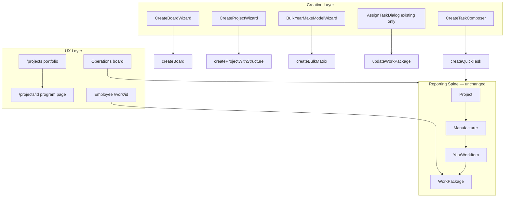

# Projects Phase 1 — Foundation Review

**Date:** June 2026  
**Scope:** Phase 1 Foundation only (not Projects 2.0 Program Builder or Intelligence)  
**Build status:** `npm run build` passes; route `/projects/[id]` live

---

## 1. Executive Summary

Phase 1 established a **single task creation path**, **project-type-aware terminology** across major surfaces, and **canonical program URLs** — without changing the reporting hierarchy, database schema, or forecast engine.

Users now:

- Create tasks through **Create Task Composer** everywhere (Projects + Operations)
- Assign **existing** tasks through **Assign existing** (no duplicate quick-create)
- Create boards through **New board** (extracted from legacy New Work wizard)
- Open programs at **`/projects/{id}`** with shareable links
- See labels that match project type (Manufacturer/Year for SI, Workstream/Milestone for ADAS, etc.)

The backend spine **Project → Manufacturer → YearWorkItem → WorkPackage** is unchanged.

---

## 2. What Was Implemented

### 2.1 Universal Task Composer

| Item | Detail |
|------|--------|
| **Component** | `src/components/work-creation/create-task-composer.tsx` |
| **Backend** | `createQuickTaskAction` → `createQuickTask` (unchanged) |
| **Features** | Auto placement inference, session memory, collapsible placement/advanced, forecast preview |
| **Mounted on** | Projects page, Operations page, `/projects/[id]` (project pre-selected) |
| **Extensions** | Controlled `open`/`onOpenChange`, `requireAssignee`, `hideTrigger` for future embeds |

### 2.2 One Task Creation Workflow

| Removed / Changed | Replacement |
|-------------------|-------------|
| `CreateTaskDrawer` (orphaned) | **Deleted** |
| `NewWorkWizard` task + project modes (~1,100 lines) | **Deleted**; task → Composer; project → existing wizards |
| `AssignTaskDialog` "Quick task" tab | **Removed** — creates via Composer only |
| `NewWorkWizard` board mode | **`CreateBoardWizard`** (`create-board-wizard.tsx`) |

**Creation entry points after Phase 1:**

| Intent | UI | Action |
|--------|-----|--------|
| New task | Create task | `createQuickTaskAction` |
| Assign existing | Assign existing | `updateWorkPackageAction` |
| New program | New Project / Bulk Y/M/M | `createProjectWithStructureAction`, `createBulkMatrixProjectAction` |
| New board | New board | `createBoardAction` |

### 2.3 Smart Labels Everywhere (Phase 1 surfaces)

**Resolver:** `getHierarchyLabels(projectType)` from `src/lib/work-packages/smart-labels.ts`  
**Display helpers:** `src/lib/projects/hierarchy-display.ts` (`structureCountSummary`, `structureSearchPlaceholder`)

| Surface | Before | After |
|---------|--------|-------|
| Projects portfolio detail sheet | Static `HIERARCHY_LABELS` | Project-type labels |
| Operations board tree | "mfr · yr · pkg", "Add Manufacturer" | Dynamic labels per project row |
| Operations dialogs | Hardcoded manufacturer/year | `projectType` prop on dialogs |
| Operations toolbar | "All manufacturers" | "All {workPackagePlural}" |
| Operations detail panel | "manufacturers · tasks" | `structureCountSummary` |
| Employee task detail | Fixed "Manufacturer" / "Year" | Smart labels from `task.project.project_type` |
| Projects / Operations page copy | "manufacturers, years" | Neutral "programs, work structure, tasks" |

**Not yet updated (Phase 2+):** `AddWorkPackageDialog` internal copy, some employee list breadcrumbs, archived `HIERARCHY_LABELS` constant (deprecated but kept for compatibility).

### 2.4 Canonical Program Pages

| Route | Purpose |
|-------|---------|
| `/projects` | Portfolio (KPIs, filters, all programs) |
| `/projects/[id]` | Single program workspace (`singleProjectMode` — no portfolio chrome) |

**Redirects / links updated:**

- `/projects?projectId=` and `?highlight=` → redirect to `/projects/[id]`
- `projectsHref()` in `deep-links.ts` → canonical path
- Planning center, calendar, template creation redirects

**ProjectWorkspace changes:**

- Program names link to `/projects/[id]` from portfolio
- `singleProjectMode` hides KPIs and filter chips on detail page

---

## 3. Architecture After Phase 1

---

## 4. MUST KEEP (Verified Unchanged)

| System | Status |
|--------|--------|
| Hierarchy FKs on WorkPackage | ✅ Unchanged |
| `createQuickTask` chain | ✅ Still single task backend |
| Forecast engine + rollups | ✅ Unchanged |
| QA / files / production pipeline | ✅ Unchanged |
| Operations tree structure | ✅ Same data; labels only |
| Project health / executive / reports | ✅ Same aggregation inputs |
| Permissions (`projects:create` vs `projects:edit`) | ✅ Unchanged |

---

## 5. Removed / Deprecated

| Item | Action |
|------|--------|
| `create-task-drawer.tsx` | Deleted |
| `new-work-wizard.tsx` | Deleted |
| Assign quick-create path | Removed from AssignTaskDialog |
| `HIERARCHY_LABELS` static usage in portfolio detail | Replaced (constant kept as deprecated) |
| Query-param project navigation as primary | Redirects to `/projects/[id]` |

---

## 6. Known Gaps (Intentionally Phase 2+)

These are **not regressions** — they were out of Phase 1 scope:

1. **`structure_mode` not persisted on Project** — labels infer from `project_type` only
2. **Task-first Operations board** — tree remains default view
3. **Program cards portfolio** — still expandable tree on `/projects`
4. **Blueprint / 3-step program setup** — still using Create Project + Bulk wizards
5. **Typed QA/files flags** — still notes prose on create
6. **Some dialogs** (`AddWorkPackageDialog`, project workspace inline dialogs) — partially label-aware via `getHierarchyLabels(project_type)` in workspace but not audited exhaustively
7. **Executive portfolio surface** — not built

---

## 7. Risk Assessment Post-Phase 1

| Risk | Level | Notes |
|------|-------|-------|
| Reporting breakage | **Low** | No schema or rollup changes |
| User confusion from renamed buttons | **Low** | "Assign existing" clarifies vs "Create task" |
| Broken bookmarks to `?projectId=` | **None** | Server redirect in place |
| ADAS users still see SI labels | **Reduced** | Ops + employee now type-aware; edge dialogs may remain |
| Dead code references | **Low** | Build passes; drawer/wizard deleted |

---

## 8. Recommended Next Steps (Phase 2 — Not Started)

When ready to proceed beyond Foundation:

1. **Program Builder** — Blueprint registry, 3-step guided setup, merge template systems
2. **Persist `structure_mode`** — additive column for label + structure recovery
3. **Portfolio UX** — Program cards default; structure tab for power users
4. **Operations task-first views** — Today / By Program / By Person
5. **Typed tracking flags** — `qa_required`, `files_required` on WorkPackage

**Do not start Phase 2 until this review is accepted.**

---

## 9. File Index (Phase 1 Touch List)

**Added**

- `src/components/work-creation/create-board-wizard.tsx`
- `src/app/(app)/projects/[id]/page.tsx`
- `src/lib/projects/hierarchy-display.ts`
- `docs/PROJECTS_PHASE1_REVIEW.md`

**Deleted**

- `src/components/work-creation/create-task-drawer.tsx`
- `src/components/work-creation/new-work-wizard.tsx`

**Major edits**

- `create-task-composer.tsx` — controlled mode, requireAssignee
- `assign-task-dialog.tsx` — existing tasks only
- `project-workspace.tsx` — canonical links, singleProjectMode
- `project-portfolio-detail-panel.tsx` — smart labels
- `employee-task-workspace.tsx` — smart labels
- `operations-board.tsx`, `operations-dialogs.tsx`, `operations-detail-panel.tsx`, `operations-toolbar.tsx`
- `deep-links.ts`, `projects/page.tsx`, `operations/page.tsx`
- `planning-center-view.tsx`, `calendar.ts`, `templates.ts`

---

## 10. Verification Checklist

- [x] Single task creation UI (`CreateTaskComposer`)
- [x] No duplicate task drawers/wizards
- [x] Smart labels on Operations, Employee, portfolio detail
- [x] `/projects/[id]` route + redirects
- [x] Production build passes
- [ ] Manual QA: create task from Projects, Operations, program page
- [ ] Manual QA: assign existing from Operations
- [ ] Manual QA: ADAS project shows Workstream/Milestone labels on ops board
- [ ] Manual QA: SI project shows Manufacturer/Year labels

---

*Phase 1 complete. Projects 2.0 Program Builder and Project Intelligence remain design-only until explicitly approved.*
