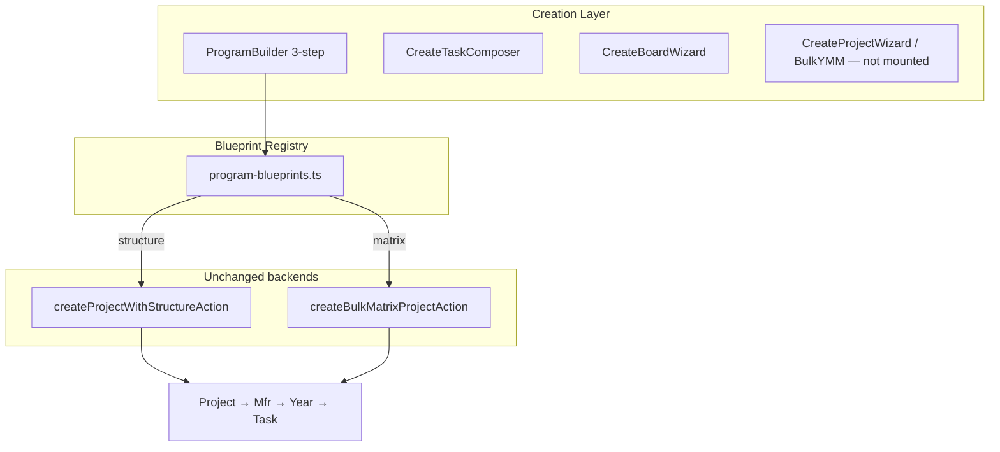

# Projects Phase 2A — Program Builder

**Date:** June 2026  
**Scope:** Phase 2A Program Builder only (not Portfolio UX, Operations task-first views, or Project Intelligence)  
**Build status:** `npm run build` passes

---

## 1. Executive Summary

Phase 2A replaces the dual **New Project** (6-step) + **Bulk Y/M/M** (6-step) entry points with a single **New Program** flow — a 3-step **Program Builder** backed by a unified **blueprint registry**.

Programs now persist **`structure_mode`** so labels can recover the intended work organization even when `project_type` alone is ambiguous.

The reporting spine **Project → Manufacturer → YearWorkItem → WorkPackage** is unchanged. Existing wizards remain in the codebase for reference but are no longer mounted on Projects pages.

---

## 2. What Was Implemented

### 2.1 Program Blueprint Registry

| Item | Detail |
|------|--------|
| **Module** | `src/lib/work-creation/program-blueprints.ts` |
| **Blueprints** | SF Phase 1, Y/M/M Matrix, SI Library Audit, ADAS Program, Admin/Research, Custom |
| **Kinds** | `structure` → `createProjectWithStructureAction`; `matrix` → `createBulkMatrixProjectAction` |
| **Defaults** | Pre-seeded OEMs, years, structure modes, template IDs |

### 2.2 Program Builder (3 steps)

| Step | Purpose |
|------|---------|
| 1. Choose blueprint | Card grid — one pick sets project type, structure mode, and presets |
| 2. Configure program | Basics + structure packages **or** matrix makes/years/models |
| 3. Review & create | `StructurePreviewPanel` or `BulkMatrixPreviewPanel` |

| Item | Detail |
|------|--------|
| **Component** | `src/components/work-creation/program-builder.tsx` |
| **Button** | **New Program** (replaces **New Project** + **Bulk Y/M/M** on `/projects` and `/projects/[id]`) |
| **Post-create** | Redirects to `/projects/{id}` |

### 2.3 Persisted `structure_mode`

| Item | Detail |
|------|--------|
| **Migration** | `supabase/migrations/031_program_structure_mode.sql` |
| **Type** | `Project.structure_mode` on `Project` + `ProjectInput` |
| **Persistence** | `flow-store`, `projects-db`, `createProjectWithStructureAction`, `createBulkMatrixProjectAction` |
| **Labels** | `getProjectHierarchyLabels(project)` prefers `structure_mode` + `project_type` |

### 2.4 Revalidation

Program creation actions now call `revalidateWorkSurfaces(projectId)` so the new program page reflects structure immediately.

---

## 3. Architecture After Phase 2A

---

## 4. MUST KEEP (Verified Unchanged)

| System | Status |
|--------|--------|
| Hierarchy FKs | ✅ Unchanged |
| Forecast / QA / reporting | ✅ Unchanged |
| `CreateTaskComposer` | ✅ Still primary task path |
| `CreateBoardWizard` | ✅ Still separate board path |
| Permissions | ✅ `projects:create` unchanged |

---

## 5. Removed (Phase 2B cleanup)

| Component | Status |
|-----------|--------|
| `create-project-wizard.tsx` | **Deleted** — replaced by Program Builder |
| `bulk-year-make-model-wizard.tsx` | **Deleted** — replaced by Program Builder |

---

## 6. Known Gaps (Phase 2B+)

1. **Portfolio program cards** — still expandable tree on `/projects`
2. **Operations task-first views** — Today / By Program / By Person
3. **Typed tracking flags** — `qa_required`, `files_required` columns on WorkPackage
4. **Enterprise template merge** — Program Builder does not yet surface `/operations/templates` enterprise templates in step 1
5. **AddWorkPackageDialog** — still a second in-tree task path (Phase 1 accepted)
6. **Full label pass** — not every surface uses `getProjectHierarchyLabels` yet (workspace + program page updated)

---

## 7. Verification Checklist

- [x] Single **New Program** entry on `/projects` and `/projects/[id]`
- [x] Blueprint registry with structure + matrix kinds
- [x] `structure_mode` migration + persistence
- [x] Production build passes
- [ ] Manual QA: SF Phase 1 blueprint creates 7 OEMs × years
- [ ] Manual QA: Y/M/M matrix blueprint generates tasks
- [ ] Manual QA: ADAS blueprint shows Workstream/Milestone labels after create
- [ ] Manual QA: Custom program with simple task list

---

## 8. File Index

**Added**

- `src/lib/work-creation/program-blueprints.ts`
- `src/components/work-creation/program-builder.tsx`
- `supabase/migrations/031_program_structure_mode.sql`
- `docs/PROJECTS_PHASE2_REVIEW.md`

**Major edits**

- `src/types/flow.ts` — `structure_mode`
- `src/lib/data/flow-store.ts`, `projects-db.ts`
- `src/app/actions/project-structure.ts`, `bulk-matrix-creation.ts`
- `src/lib/projects/hierarchy-labels.ts` — `getProjectHierarchyLabels`
- `src/app/(app)/projects/page.tsx`, `projects/[id]/page.tsx`
- `src/components/projects/project-workspace.tsx`

---

## 9. Phase 2A Validation Audit

**Date:** June 2026  
**Method:** Static code audit + `npm run build` (pass). No runtime browser QA executed in this session. **No automated test suite** exists in the repository.

### Verdict

**Program Builder is structurally sound but not fully validated for production default status.**

| Gate | Status |
|------|--------|
| Compile / typecheck | ✅ Pass |
| Single New Program entry | ✅ Pass |
| Old wizards unmounted | ✅ Pass |
| Board + Composer unchanged | ✅ Pass |
| Blueprint registry wired to correct backends | ✅ Pass |
| `structure_mode` persistence (code path) | ✅ Pass |
| `structure_mode` label propagation (all surfaces) | ⚠️ Partial |
| Structure preview vs created counts | ❌ Fail |
| Forecast / tracking on structure blueprints | ⚠️ Partial |
| Permissions (all `projects:create` roles) | ⚠️ Partial |
| Manual end-to-end QA | ⏸ Not run |
| DB migration `031` applied | ⏸ Unknown |

**Recommendation: Hold Phase 2B** until manual QA completes and findings F-01 through F-04 below are addressed (or explicitly accepted).

---

### 9.1 Entry Points — Passed (static)

| Check | Result | Evidence |
|-------|--------|----------|
| `/projects` single **New Program** | ✅ | `projects/page.tsx` mounts `ProgramBuilder` only when `allowedModes.includes("project")` |
| `/projects/[id]` single **New Program** | ✅ | Same pattern in `projects/[id]/page.tsx` |
| Old **New Project** wizard not mounted | ✅ | `CreateProjectWizard` — zero imports outside its own file + docs |
| Old **Bulk Y/M/M** not mounted | ✅ | `BulkYearMakeModelWizard` — zero imports outside its own file + docs |
| **New board** still separate | ✅ | `CreateBoardWizard` on Projects + Operations |
| Task creation via **CreateTaskComposer** | ✅ | Mounted on Projects, Operations, program page |
| No dead buttons to old flows | ✅ | Grep: no `New Project` / `Bulk Y/M/M` strings in mounted pages |

---

### 9.2 Blueprint Validation (static trace)

| Blueprint | `project_type` | `structure_mode` | Backend | Presets | Labels (expected) | Redirect |
|-----------|----------------|------------------|---------|---------|-------------------|----------|
| SF Phase 1 | `special_functions` | `by_manufacturer` | `createProjectWithStructureAction` | 7 OEMs × 10 years | Manufacturer / Year | ✅ `router.push(/projects/{id})` |
| Y/M/M Matrix | `special_functions` | `by_manufacturer` | `createBulkMatrixProjectAction` | 7 makes, 4 default years | Manufacturer / Year | ✅ |
| SI Library Audit | `si_corrections` | `by_manufacturer` | structure action | None — user picks packages | Manufacturer / Year | ✅ |
| ADAS Program | `adas` | `by_workstream` | structure action | None — user picks workstreams | Workstream / Milestone | ✅ |
| Admin / Research | `research` | `custom` | structure action | None — user picks packages | Package / Phase | ✅ |
| Custom Program | `custom` | `custom` (overridable step 2) | structure action | Blank package draft | Package / Phase (default) | ✅ |

**Blueprint notes (non-blocking but important for manual QA):**

- **SI, ADAS, Admin, Custom** require the user to select at least one work package/workstream in step 2 — no auto-seed beyond empty draft.
- **SF Phase 1** sets `taskSetupMode: "template"` — backend creates 4 standard tasks per OEM on the **first year only** (28 tasks total). This matches legacy `createProjectWithStructureAction` behavior.
- **Matrix** defaults: `useModelCount: true`, `modelCountPerGroup: 1`, `docsPerTask: 10`, `qaRequired: true` — from `emptyBulkMatrixDraft`, not exposed in Program Builder step 2 UI.

**Runtime status:** ⏸ Not browser-tested per blueprint.

---

### 9.3 Structure Mode — Partial

| Check | Result | Notes |
|-------|--------|-------|
| Saved on create (in-memory) | ✅ | `flow-store.createProject` sets `structure_mode` |
| Saved to Supabase | ✅ | `projects-db.projectToRow` includes column |
| Graceful if migration missing | ⚠️ | `insertProjectDb` falls back to non-extended row — **`structure_mode` silently dropped** until `031` applied |
| Loaded on hydrate | ✅ | `mapProject` reads `structure_mode` |
| Labels on `/projects` workspace | ✅ | `getProjectHierarchyLabels(project)` |
| Labels on `/projects/[id]` header | ✅ | Same helper |
| Labels on **Operations** board | ❌ | Still `getHierarchyLabels(node.project.project_type)` — ignores persisted `structure_mode` |
| Labels on **Employee** task detail | ❌ | Still `getHierarchyLabels(task.project?.project_type)` only |
| Labels on portfolio detail / Composer | ❌ | Still `project_type` only |

**Impact:** SI and ADAS blueprints show correct labels today because `project_type` aligns with blueprint defaults. **Custom program with a overridden structure mode** (e.g. user picks `by_workstream` on a `custom` type) will show wrong labels on Operations and Employee after refresh.

---

### 9.4 Structure Creation — Partial

| Check | Result |
|-------|--------|
| Project record created | ✅ |
| Manufacturers / workstreams created | ✅ |
| Year/phase rows created | ✅ |
| Template tasks created (SF/SI/ADAS with template mode) | ✅ (backend) |
| Preview task count matches created count | ❌ **F-01** |
| Duplicate empty manufacturers | ✅ No — validation requires named packages |
| Orphan records | ✅ No — FK chain preserved |

**F-01 — Structure preview undercounts template tasks**

`buildStructurePreview` counts only `pkg.tasks.length`. Template-mode packages (`taskSetupMode: "template"`) have empty `tasks[]` at preview time but `resolveTasksForPackage` creates tasks from `STANDARD_TASK_TEMPLATES` on submit. Step 3 preview shows **0 tasks** for SF Phase 1 while creation produces **28**.

---

### 9.5 Matrix Creation — Passed (static) / ⏸ runtime

| Check | Result |
|-------|--------|
| Makes → manufacturers | ✅ `ensureManufacturer` |
| Years → year work items | ✅ `ensureYear` |
| Tasks generated per matrix rows | ✅ `generateMatrixRows` → `createWorkPackage` |
| Preview count matches backend | ✅ Same `generateMatrixRows` used in preview + action |
| Forecast estimates in preview | ✅ `buildBulkMatrixPreview` uses forecast engine |
| Large-batch UI warning | ⚠️ **F-02** — capacity shown as label (`Critical — review capacity`) but no confirm/block like old wizard may have had |
| QA/file flags on tasks | ✅ Notes prose via `taskNotes(qaRequired, filesRequired)` |
| Reporting spine | ✅ Same FK chain |

Default matrix with 7 makes × 4 years × 1 model = **28 tasks** — preview and action aligned.

---

### 9.6 Forecasting — Partial

| Path | Result | Notes |
|------|--------|-------|
| Matrix: project `estimated_total_documents` | ✅ | `rows.length × docsPerTask` |
| Matrix: per-task doc count | ✅ | `estimated_document_count` on work packages |
| Matrix: preview hours/days/completion | ✅ | `buildBulkMatrixPreview` |
| Structure: project-level planning forecast | ⚠️ **F-03** | Program Builder does **not** pass `estimatedDocuments`, `estimatedHours`, or `trackingNotes` to `createProjectWithStructureAction` (old 6-step wizard did) |
| Structure: template task hours | ✅ | Default 8h per task in action |
| Project health / planning / reports inputs | ✅ | Unchanged aggregation — receives real work packages |
| Placeholder/fake forecast values | ✅ None introduced |

---

### 9.7 QA / Files / Metrics — Partial

| Item | Result |
|------|--------|
| QA on matrix tasks | ✅ Notes: "QA required" when `qaRequired: true` (default) |
| Files on matrix tasks | ✅ Notes when enabled (default off) |
| QA on structure template tasks | ✅ From `taskNotes(task)` using draft tracking defaults (`qaRequired: true` in empty draft) |
| Typed `qa_required` / `files_required` columns | ⏸ Not built (Phase 2B+ scope) — still notes prose |
| `seedMetricsForProject` for non-custom templates | ✅ SF, SI, ADAS, research templates seeded |
| Activity / audit logs | ✅ `writeAuditLog` on both actions |
| Custom metrics UI in Program Builder | ❌ Not exposed (was in old wizard step 5) |

---

### 9.8 Revalidation — Passed (static)

| Check | Result |
|-------|--------|
| Redirect after create | ✅ `router.push` + `router.refresh()` |
| `revalidateWorkSurfaces(projectId)` | ✅ Both `project-structure.ts` and `bulk-matrix-creation.ts` |
| `/projects/[id]` path included | ✅ Via `revalidateWorkSurfaces` |
| Operations / project-health / reports paths | ✅ In `WORK_SURFACE_PATHS` |

Runtime stale-state: ⏸ Not browser-tested.

---

### 9.9 Old Paths — Passed

| Component | Mounted? |
|-----------|----------|
| `create-project-wizard.tsx` | ❌ Not mounted |
| `bulk-year-make-model-wizard.tsx` | ❌ Not mounted |

Files remain in repo for reference only.

---

### 9.10 Permissions — Partial

| Role | `projects:create` | Sees **New Program**? | Notes |
|------|-------------------|----------------------|-------|
| `admin` | ✅ | ✅ | `getAllowedCreationModes` |
| `manager` | ✅ | ✅ | Same |
| `teamlead` | ✅ | ✅ | No board creation |
| `super_admin` | ✅ | ❌ **F-04** | Has permission but `getAllowedCreationModes` only checks `admin \|\| manager` |
| `senior_manager` | ✅ | ❌ **F-04** | Same gap |
| `employee` | Only with `projects:edit` | Task only | Correct — no program create |
| `viewer` | ❌ | ❌ | Cannot access `/projects` |

Page access is gated separately; senior roles can open `/projects` but may see **no creation toolbar**.

---

### 9.11 UI — Passed (static review) / ⏸ runtime

| Check | Result |
|-------|--------|
| 3-step wizard layout (`WizardDialogContent size="xl"`) | ✅ Not cramped vs old 6-step |
| Blueprint cards readable | ✅ Label + description + highlight chips |
| Step 2 fields | ✅ Basics + structure/matrix split |
| Step 3 preview panels | ⚠️ Structure preview inaccurate for template tasks (F-01) |
| Business-friendly labels in builder | ✅ Uses `getHierarchyLabels(type, mode)` |
| UUIDs in UI | ✅ None in builder flow |
| Hardcoded Manufacturer/Year on ADAS blueprint cards | ✅ Cards use neutral blueprint copy |

---

### 9.12 Acceptance Criteria Scorecard

| # | Criterion | Status |
|---|-----------|--------|
| 1 | Every blueprint creates valid projects | ⚠️ Static yes; runtime ⏸ |
| 2 | `structure_mode` persists | ⚠️ Yes if migration applied |
| 3 | Labels correct after refresh | ⚠️ Partial (Operations/Employee gap) |
| 4 | Redirects work | ✅ Code verified |
| 5 | Forecasting connected | ⚠️ Matrix yes; structure degraded vs old wizard |
| 6 | Reporting connected | ✅ |
| 7 | Old wizards not user-facing | ✅ |
| 8 | No dead buttons | ✅ |
| 9 | No stale project page after creation | ✅ Revalidation wired |
| 10 | Build passes | ✅ |

**Score: 5 pass, 4 partial, 1 fail (preview accuracy)**

---

### 9.13 Findings Summary

#### Critical / Blockers (fix before Phase 2B)

| ID | Finding | Fix suggestion |
|----|---------|----------------|
| F-04 | `super_admin` / `senior_manager` cannot see **New Program** | Extend `getAllowedCreationModes` to include roles with `projects:create` |
| — | Manual QA not executed | Run checklist in §9.14 in browser |
| — | Migration `031` may not be applied | Apply before Supabase production validation |

#### Moderate (fix or accept before default status)

| ID | Finding | Fix suggestion |
|----|---------|----------------|
| F-01 | Structure preview shows 0 template tasks | Teach `buildStructurePreview` to resolve template task counts |
| F-03 | Structure programs omit planning estimates from UI | Pass `estimatedDocuments` / `estimatedHours` / tracking toggles in step 2 or blueprint defaults |
| F-05 | `structure_mode` not used on Operations / Employee / Composer | Switch to `getProjectHierarchyLabels(project)` |

#### Low / Documented gaps

| ID | Finding |
|----|---------|
| F-02 | Matrix shows capacity impact label but no explicit large-batch confirm dialog |
| F-06 | ADAS/SI/Admin blueprints require manual package selection (by design, but easy to miss) |
| F-07 | Enterprise templates not in blueprint step 1 |
| F-08 | Typed QA/file columns still not on WorkPackage |

---

### 9.14 Manual QA Checklist (required before Phase 2B)

- [ ] Apply migration `031_program_structure_mode.sql`
- [ ] SF Phase 1: 7 OEMs, 70 year rows, 28 template tasks, labels Manufacturer/Year
- [ ] Y/M/M Matrix: preview task count = created count; redirect loads structure
- [ ] SI Library Audit: add packages, create, verify SI labels
- [ ] ADAS Program: add workstreams, verify Workstream/Milestone on program page **and** Operations
- [ ] Admin/Research: create with custom packages
- [ ] Custom + `simple_task_list` structure mode
- [ ] Refresh `/projects/{id}` — structure persists
- [ ] Operations board shows new program without hard refresh
- [ ] Project Health / Reports reflect new tasks (matrix path)
- [ ] `super_admin` / `senior_manager` can see **New Program** (after F-04 fix)
- [ ] Employee role cannot see **New Program**

---

### 9.15 Phase 2B Gate Recommendation

| Option | When |
|--------|------|
| **Hold Phase 2B** | Recommended now — complete manual QA, fix F-04 (permissions), F-01 (preview), F-05 (labels on Operations/Employee) |
| **Approve Phase 2B with accepted gaps** | Only if F-04 + manual QA pass and F-01/F-03/F-05 documented as follow-up patches |

Program Builder **can replace old wizards as the default path** once manual QA passes and F-04 is resolved. It should **not** be treated as fully production-validated until then.

---

### 9.16 Post-Validation Fixes Applied (2026-06-23)

| ID | Status | Fix |
|----|--------|-----|
| F-01 | ✅ Fixed | Shared `resolve-package-tasks.ts`; `buildStructurePreview` counts template tasks and shows them in tree |
| F-02 | ✅ Fixed | Matrix create confirms when >100 tasks or high/critical capacity impact |
| F-03 | ✅ Fixed | Program Builder step 2: est. documents/hours + QA/files toggles; passed to `createProjectWithStructureAction`; auto-estimates hours from template task count |
| F-04 | ✅ Fixed | `getAllowedCreationModes` uses `hasPermission(projects:create)` — `super_admin`, `senior_manager` now see **New Program** |
| F-05 | ✅ Fixed | `getProgramLabels` / `getProjectHierarchyLabels` on Operations board, detail panel, dialogs, Employee, Composer, portfolio, add-work-package |
| F-06 | ✅ Improved | SI/ADAS/Admin blueprints pre-seed one default package/workstream |
| Build | ✅ Pass | `npm run build` |

**Still open:** Manual QA (§9.14), migration `031` on Supabase, typed QA/file columns (F-08), enterprise templates in builder (F-07).

**Updated recommendation:** Fix blockers cleared in code — **run manual QA + apply migration**, then Phase 2A can be accepted; Phase 2B still hold until sign-off.

---

*Phase 2A implementation complete. Phase 2B (portfolio UX, operations views) and Project Intelligence remain future work — do not start until this validation gate clears.*
